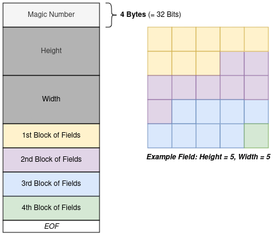
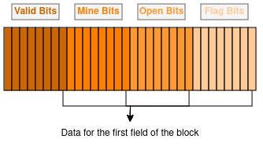

# Assignment : Minesweeper

## Description
The goal of this assignment is to implement the well-known 2D-game *Minesweeper*.

### General Rules
Minesweeper is a single-player game played on a 2-dimensional grid of fields. The goal of the game is open all fields,
except for the ones which hide mines. If a field with a mine is opened, the mine explodes and the game is lost. Each 
opened field bears the number of mines on the 8 fields surrounding it, or no number if there are no mines. Whenever a 
field is opened, if it bears no number, all adjacent fields are also opened until each opened field bears a number. If
the player suspects a field to hide a mine, they can put a flag on it. The game is over when all fields which do not
contain mines are opened; in this case, the player wins. If a field containing a mine is opened, the player loses.

The first opened field never contains a mine. Opening the first field triggers the generation of the game map.

More information can be found on [Wikipedia](https://en.wikipedia.org/wiki/Minesweeper_(video_game)).

The behaviour of the original game (which the implementation should mostly copy) can be tested at 
[Minesweeper Online](https://minesweeper.online/).

### Important Remarks on the Game Board
The game board should support side lengths of up to 18446744073709551616 (or 2^64). However, you do not have to explicitly
handle cases where the product of the side lengths is larger than this number. The maximum number of mines on the board
is one less than the number of fields, as the starting field must not hide a mine. 

The memory for the game board must be allocated before the game starts, i.e., before printing the welcome message. In
this context, consider the possible size of the board and choose a way to allocate memory such that your program does not
become unbearably slow (We do not test for performance, but one or two testcases could time out).
 
## Program Sequence
In the following, a complete run of the program is described.

### Command Line Arguments
The program receives three optional command line arguments: `--size`, `--mines` and `--seed`. Each of these arguments
comes with some parameters, as described in the table below. The arguments can appear in any order, however, the
parameters must directly follow the argument; otherwise, an error is thrown (see further down). If any of the
arguments is not given in the command line, its default value should be used, as described in the table below.  

| Argument  | Num. Params (Type) | Parameters      | Default | Description                            |
| --------- | ------------------ | --------------- | ------- | -------------------------------------- |
| `--size`  | 2 (int, int)       | `height width ` | **9 9** | (usual field size of *Beginner* level) |
| `--mines` | 1 (int)            | `count`         | **10**  | (usual mine count of *Beginner* level) |
| `--seed`  | 1 (int)            | `seed`          | **0**   |                                        |

An argument may be given multiple times; in that case, anything but its last occurrence should be ignored.

### Commands
When running, the program should always output the following command prompt (mind the spaces):

```
 > 
```

If the prompt is not printed, the testcases will time out!

| Command | Parameters | Description                                      |
| ------- | ---------- | ------------------------------------------------ |
| `start` | `row col`  | Generates the map and opens the field            |
| `open`  | `row col`  | Opens the field                                  |
| `flag`  | `row col`  | Marks a field with a flag                        |
| `dump`  | *none*     | Shows the uncovered map, without ending the game |
| `save`  | `filename` | Saves the current game to a file                 |
| `load`  | `filename` | Loads a game from a file                         |
| `quit`  | *none*     | Quits the game and shows the uncovered map       |

In the table, `row col` denote the 0-based coordinates of the field to access, and `filename` is the file to use.

### Course of the Game
1. The first prompt is shown without printing the field.
2. The player starts the game by using the command `start <row> <col>`, indicating the first field to be opened.
3. If the coordinates are valid, the map is generated (see below) and the field is opened.
4. Then, each turn the player can use `open <row> <col>` to open or `flag <row> <col>` to flag the specified field.
5. If the player either wins or loses (as specified in *General Rules*) the game ends immediately. The field is printed
   once more, revealing all mines. If the player lost the game, the mine which caused the loss is indicated with a 
   red background.

Additional commands allow to load or save  the current state of the game at any point throughout the gameplay. This
includes the position of **mines** and **flags**, as well as **opened fields**. For further information consult the 
chapter on the [file format](#file-format).

### Output of the Playing Field
The playing field is printed using extended ASCII characters. The following table contains the character used for each
 item in the game. The color of some characters is changed during output, which is indicated by *Color Modifier*.

| Character | ASCII number | Color Modifier      | Item                              |
| --------- | ------------ | ------------------- | --------------------------------- |
| `=`       | 61           | *none*              | Vertical field border             |
| `\|`      | 124          | *none*              | Horizontal field border           |
| `░`       | 176          | *none*              | Closed field                      |
| `·`       | 250          | *none*              | Opened field (no adjacent mines)  |
| `1-8`     | 49-56        | *none*              | Opened field (1-8 adjacent mines) |
| `¶`       | 244          | `\033[31m`*         | Flagged field                     |
| `@`       | 64           | `\033[33m`*         | Mine (normal)                     |
| `@`       | 64           | `\033[33m\033[41m`* | Mine (highlighted)                |

<sub>\* *Afterwards the reset sequence `\033[0m` needs to be used to reset all colors (character & background) to default.*

*Attention:* When using color modifiers, make sure to stick to this scheme for each character: modifier - character - reset.
Otherwise, the test cases will fail, as they count the color modifiers and reset sequence as separate characters and
your output won't match the expected output any longer.

The playing field contains one character per field and is surrounded by the respective vertical and horizontal border 
characters.

**Remaining Flags**

Above the field, the number of remaining flags is indicated. The starting value for the number of 
remaining flags is the number of mines hidden in the playing field. For each flag placed, the number decreases by 1 
(therefore the value can also become *negative*). If a field is opened after it was flagged, the flag is not longer
 counted as *placed* in the following. If a flag is placed on an already opened field, the flag will therefore also
 not be counted for the remaining flags. The field does however show up in the save file as flagged.

**Example Field Layout**

These example layouts are shown **without prompts** and **without the correct character colors**.
Complete program sequences with characters in correct colors can be found in the **public testcases**.

```
  ¶: 8
  ========= 
 |░░░░░░░░░|
 |░¶░░░░░░░|
 |░211░░░░░|
 |11·1░░░░░|
 |···1░░░░░|
 |1111¶2░░░|
 |░░░░░░░░░|
 |░░░░░░░░░|
 |░░░░░░░░░|
  =========
```
*Field size: 9 x 9, 10 mines hidden, 2 flags placed.*

```
  ¶: 37
  ================ 
 |░░░░░░░░░░░░░¶1·|
 |░░░░░░░░░░░░░21·|
 |░░░░░░░░░░░321··|
 |░░░░░░░░░211····|
 |░░░░░░░░░1··111·|
 |░░░░░░░░░2111░21|
 |░░░░░░░░░░░░░░░░|
 |░░░░░░░░░░░░░░░░|
 |░░░░░░░░░░░░░░░░|
 |░░░░░░░░░░░░░░░░|
 |░░░░░░░░░░1░░░░░|
 |░░░░░░░░░░░░░░░░|
 |░░░░░311░░░░░░░░|
 |░¶░░░2·1111░░░21|
 |12¶321····11211·|
 |·1░1············|
  ================ 

```
*Field size: 16 x 16, 40 mines hidden, 3 flags placed.*

### Map Generation Algorithm
The map generation is triggered by the *start* command (see below), which comes with a pair of coordinates. These
coordinates are the starting field, which is guaranteed not to be a mine.

To generate the map, we use the following algortihm:
```ada
procedure MapGeneration(board, height, width, number_of_mines, starting_field):
  fields_left := height * width - 1  // Do not count the starting field
  mines_left := number_of_mines

  for row in 0 up to height:
    for column in 0 up to width:
      if board[row][column] is starting_field:
        board[row][column].bomb := False
        continue

      random_number := generate_64bit_random_number() mod fields_left
      if random_number < mines_left:
        board[row][column].bomb := True
        mines_left := mines_left - 1
      else
        board[row][column].bomb := False

      fields_left := fields_left - 1
```
This algorithm both guarantees that we end up with the correct number of mines, and that the starting field is not a
mine. If you do not implement this algorithm exactly like specified, you might generate a different field, which will
lead to a lot of failing testcases! Therefore, stick to the specification as closely as possible. 

#### Pseudorandom Number Generator
To generate random numbers, we use the `rand()` function from the C standard library. This function returns a sufficiently
random number on each call.

The numbers are not truly random, but [pseudorandom](https://en.wikipedia.org/wiki/Pseudorandomness). This has the side
effect that the generated numbers are reproducible by using a seed. This seed is passed to the pseudorandom number
generator once, before all numbers are generated. In the C implementation, the function `srand()` is used to pass the
seed to the generator. **Call `srand()` exactly *once* at the very beginning of your program with the seed passed as a
command line argument.**

There is one more caveat: Due to the theoretical size of the game board, we need to generate a random number with a
size of 64 bit, but `rand()` returns only a 32-bit number. To receive a 64-bit random number, we use the following trick:
First, we generate the upper 32 bit of the number with a call to `rand()`. Then, we generate the lower 32 bit with another
call to `rand()`. Finally, we merge these two 32-bit numbers into a 64-bit number using bit operations (bit shift and bitwise or).  

### Example Gameplay
After starting the game the first output should show the start message and the selected field size, as well as
the number of mines which are placed in the playing field once the map is generated. Note that you must allocate the 
memory for the field *before* you display this message!

So if the game is started without using any command line
arguments, the following message should be displayed:

```
Welcome to ESP Minesweeper!
Chosen field size: 9 x 9.
After map generation 10 mines will be hidden in the playing field.
 > 
```
**start**

After the start message the player is prompted to input a command. At this point only the commands
*load* and the *start* command are available. Using the *start* command will generate the map and open the first field:

```
Welcome to ESP Minesweeper!
Chosen field size: 9 x 9.
After map generation 10 mines will be hidden in the playing field.
 > start 5 5

  ¶: 10
  ========= 
 |░░░░░░░░░|
 |░░░░░░░░░|
 |░░░░░░░░░|
 |░░░░░░░░░|
 |░░░░░░░░░|
 |░░░░░2░░░|
 |░░░░░░░░░|
 |░░░░░░░░░|
 |░░░░░░░░░|
  ========= 
 > 

```
If the *start* command is used throughout the game, a new game should be generated and the old one is lost, just like
when calling *start* for the first time.

See the section on [map generation](#map-generation-algorithm) for more information.

**dump**

The *dump* command will print the playing field twice: The first output shows all mines and every field indicates the
number of adjacent mines with a number (every field is opened). The second output shows the playing field in its normal
state during the previous turn:

```
 > dump

  ¶: 10
  ========= 
 |111··111·|
 |2@1··1@1·|
 |@2111211·|
 |11·1@211·|
 |···112@1·|
 |11111211·|
 |1@22@211·|
 |23@212@1·|
 |@211·111·|
  ========= 

  ¶: 10
  ========= 
 |░░░░░░░░░|
 |░░░░░░░░░|
 |░░░░░░░░░|
 |░░░░░░░░░|
 |░░░░░░░░░|
 |░░░░░2░░░|
 |░░░░░░░░░|
 |░░░░░░░░░|
 |░░░░░░░░░|
  ========= 
 > 
```
**open**

The *open* command opens a field and reveals either a mine or the number of mines in adjacent fields If the opened
field is a mine the game ends immediately. If the number of mines adjacent to the opened field is `1-8`, this number is 
indicated at this field from this point on for all the following turns. If the number of mines adjacent to the opened
field is `0` adjacent fields are opened until the border to closed fields is filled with numbers between `1` and `8`.
This means, each time the command `open` is used, numbers are revealed (or the game ends if the field contains a mine):

```
 > open 4 0

  ¶: 10
  ========= 
 |░░░░░░░░░|
 |░░░░░░░░░|
 |░211░░░░░|
 |11·1░░░░░|
 |···1░░░░░|
 |1111░2░░░|
 |░░░░░░░░░|
 |░░░░░░░░░|
 |░░░░░░░░░|
  ========= 
 > 
```

**flag**

Flags can be used to mark fields which the player suspects are mines. If the `flag` command is called on a field which
was already flagged before, the flag is removed (this can be repeated indefinitely). If such a field is opened during a
later stage of the game and it does not contain mines, the field is opened like every unmarked field. For this, it does
not matter if the field was opened directly or is part of the opening process of an adjacent field.
The flag on an open field will not be shown when printing and it does not count towards the remaining flags. However,
the field will still be marked as flagged in a save file as long as the flag is not removed again using the `flag`
command:

```
 > flag 1 3

  ¶: 9
  ========= 
 |░░░░░░░░░|
 |░░░¶░░░░░|
 |░211░░░░░|
 |11·1░░░░░|
 |···1░░░░░|
 |1111░2░░░|
 |░░░░░░░░░|
 |░░░░░░░░░|
 |░░░░░░░░░|
  ========= 
 > open 0 4

  ¶: 10
  ========= 
 |░░1··1░░░|
 |░░1··1░░░|
 |░21112░░░|
 |11·1░░░░░|
 |···1░░░░░|
 |1111░2░░░|
 |░░░░░░░░░|
 |░░░░░░░░░|
 |░░░░░░░░░|
  ========= 
 > 
```
**save and load**

The game can be saved at any turn using the command *save*. The filename needs to be specified 
(information on the file format can be found in [File Format](#file-format)). After saving, the current state of the game is
printed again. If the game is loaded using the command *load* the imported game overwrites the current game:

```
 > save game

  ¶: 10
  ========= 
 |░░1··1░░░|
 |░░1··1░░░|
 |░21112░░░|
 |11·1░░░░░|
 |···1░░░░░|
 |1111░2░░░|
 |░░░░░░░░░|
 |░░░░░░░░░|
 |░░░░░░░░░|
  ========= 
 > open 8 8

  ¶: 10
  ========= 
 |░░1··1░1·|
 |░░1··1░1·|
 |░21112░1·|
 |11·1░░░1·|
 |···1░░░1·|
 |1111░2░1·|
 |░░░░░░░1·|
 |░░░░░░░1·|
 |░░░░░░░1·|
  ========= 
 > load game

  ¶: 10
  ========= 
 |░░1··1░░░|
 |░░1··1░░░|
 |░21112░░░|
 |11·1░░░░░|
 |···1░░░░░|
 |1111░2░░░|
 |░░░░░░░░░|
 |░░░░░░░░░|
 |░░░░░░░░░|
  ========= 
 > 
```

*Hint: Make sure to open files with as many permissions as necessary, but as few as possible!*

**quit**

The game can be ended at any time with the "quit" command. After using this command, the playing field is printed once
more:

```
 > quit

  ¶: 10
  ========= 
 |░░1··1░░░|
 |░░1··1░░░|
 |░21112░░░|
 |11·1░░░░░|
 |···1░░░░░|
 |1111░2░░░|
 |░░░░░░░░░|
 |░░░░░░░░░|
 |░░░░░░░░░|
  ========= 

```

### End of Game

**Loss**

The game ends immediately if a player opens a field, which contains a mine. In this case the message 
`=== You lost! ===` is printed, as well as the playing field with all mines revealed. The mine on the opened field
 is highlighted with a red background (as described in the chapter **Output of the Playing Field**, for examples consult the output of the **public testcases**). 

```
  ¶: 1
  ========= 
 |111··111·|
 |2¶1··1¶1·|
 |¶2111211·|
 |11·1¶211·|
 |···112¶1·|
 |11111211·|
 |1¶22¶211·|
 |23¶212¶1·|
 |░░11·111·|
  ========= 
 > open 8 0

=== You lost! ===

  ¶: 1
  ========= 
 |111··111·|
 |2@1··1@1·|
 |@2111211·|
 |11·1@211·|
 |···112@1·|
 |11111211·|
 |1@22@211·|
 |23@212@1·|
 |@░11·111·|
  ========= 

```

**Win**

If all fields not containing mines are opened, the player wins the game. For this it does not matter if the mines are
marked with flags or not. In this case, the message `=== You won! ===` is printed, as well as the final playing field
with all mines revealed. No fields are highlighted.

```
  ¶: 1
  ========= 
 |111··111·|
 |2¶1··1¶1·|
 |¶2111211·|
 |11·1¶211·|
 |···112¶1·|
 |11111211·|
 |1¶22¶211·|
 |23¶212¶1·|
 |░░11·111·|
  ========= 
 > open 8 1

=== You won! ===

  ¶: 1
  ========= 
 |111··111·|
 |2@1··1@1·|
 |@2111211·|
 |11·1@211·|
 |···112@1·|
 |11111211·|
 |1@22@211·|
 |23@212@1·|
 |@211·111·|
  ========= 

```

### File Format
In the following, the format of the file to save and load games from is specified.

The file format consists of four parts:
1. The magic number `ESP\0` (4 Bytes or 32 Bits)
2. The height of the board (8 Bytes or 64 Bits)
3. The width of the board (8 Bytes or 64 Bits)
4. A list of blocks with information (each 4 Bytes or 32 Bits)

A block has a size of 32 Bits and contains information about several fields. It is structured as follows, in this order:
- 8 [valid bits](#valid-bit) 
- 8 [mine bits](#mine-bit)
- 8 [open bits](#open-bit)
- 8 [flag bits](#flag-bit)

These 8 bits correspond to the information of 8 fields on the board. Therefore, if the overall number of fields on the
board is not a multiple of 8, "empty" padding fields are appended at the end. This does not affect the actual board, but
only its representation in the file. Padding fields have all of their four bits set to 0.

The bits in a block correspond to the fields on the board from the Least Significant Bit (LSB) to the Most Significant Bit (MSB),
i.e., the fields within a block are in reverse order. The blocks themselves are ordered "normally", the same way
as the board. 

Each field's properties are stored in 4 bits. These bits are further explained in the following sections. The graphics
below illustrate how the file format should be understood. 

The first graphic shows the file's format with correspondence to an example minesweeper field. The colors indicate
which fields of the board are stored in which 32-bit block of the file. EOF should not take any room in the file and
is just inserted for clarity.



The second graphic shows a single block within the file in closer detail. Each of the thin rectangles represents a
single bit in the block. The 4 bits which represent the data of the first field of the block are marked with an
arrow. The bits that belong to the second field sit to the left of them, and so on.



*Hint: The seemingly reversed block structure makes more sense when you think about the bitshifts you need in order to
access these bits.*

#### Valid bit
The valid bit denotes whether a block in the file is valid, i.e., represents a field on the board, or is merely part of
the padding. If the valid bit is set to 1, the field is valid, if it is set to 0, it is for padding only. *Attention:
If the valid bit is set to 0, all other bits **must** be set to 0, either!*

#### Mine bit
The mine bit denotes whether the corresponding field on the board hides a mine or not. If the mine bit is set to 1, the
field hides a mine, if it is set to 0, it does not.

#### Open bit
The open bit denotes whether the corresponding field on the board was already opened or not. If the open bit is set to 1,
the field is open, if it is set to 0, it is closed.

#### Flag bit
The flag bit denotes whether the corresponding field on the board is currently flagged or not. If the flag bit is set to 1,
there is a flag on the field, if it is set to 0, there is no flag on the field.

### Error Messages and Exit Codes
While the program is running, the following errors must be detected and handled:

| Exit Code | Error Message                                           | Error to detect                                                                     | Game phase    |
|-----------|---------------------------------------------------------|-------------------------------------------------------------------------------------|---------------|
| 1         | `"Out of memory!\n"`                                    | Out of memory, allocation failed                                                    | CLI Arguments |
| 2         | `"Invalid number of parameters given!\n`                | The argument count has an inconsistent value                                        | CLI Arguments |
| 3         | `"Unexpected argument provided!\n"`                     | An argument which does not exist was passed to the program                          | CLI Arguments |
| 4         | `Invalid type for argument!\n`                          | A parameter for an argument was not of the expected type                            | CLI Arguments |
| 5         | `Invalid value for argument!\n`                         | The value of a parameter was invalid                                                | CLI Arguments |
|           | `Error: Unknown command!\n`                             | An unknown command was entered                                                      | Gameplay      |
|           | `Error: Command is missing arguments!\n`                | The command requires more arguments than entered                                    | Gameplay      | 
|           | `Error: Too many arguments given for command!\n`        | There were more arguments given than the command requires                           | Gameplay      |
|           | `Error: Invalid arguments given!\n`                     | A given argument was not valid, e.g., because it has the wrong type                 | Gameplay      |
|           | `Error: Coordinates are invalid for this game board!\n` | The given coordinates would not be on the game board                                | Gameplay      |
|           | `Error: Failed to open file!\n`                         | The file could not be opened/does not exist                                         | Gameplay      |
|           | `Error: Invalid file content!\n`                        | The magic number in the file was incorrect/not there                                | Gameplay      |

Other errors, which are not mentioned here, do not have to be detected or handle; you may assume they will never occur.
If an exit code is specified, the program should terminate with that return value. Otherwise, the program should not
exit, but continue to run. After a successful run without any errors, the program should return 0.

If an error is encountered within the game, while handling a command, the command prompt should be printed again after
the corresponding error message has been output and the game should continue as if the failing command has never been 
entered.


